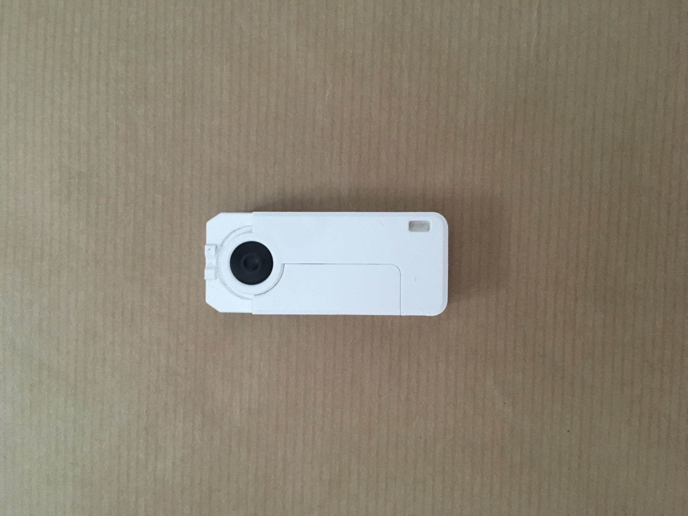
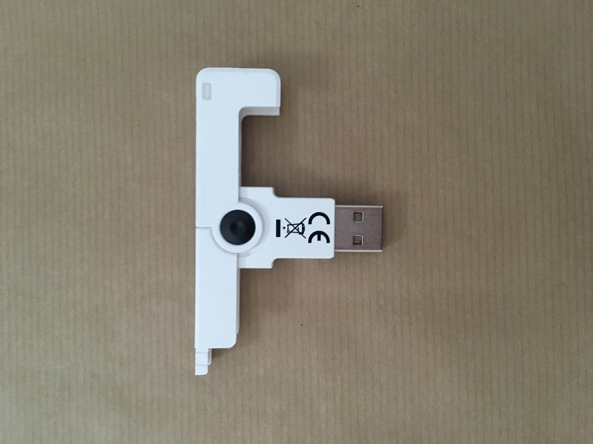

# Smartcard API


## Examples

```javascript
var cardreader = require('card-reader');
var iso7816 = require('iso7816');

cardreader.on('device-activated', function (reader) {
    console.info(`Device '${reader.name}' activated`);
});

cardreader.on('device-deactivated', function (reader) {
    console.info(`Device '${reader.name}' deactivated`);
});

cardreader.on('card-removed', function (reader) {
    console.info(`Card removed from '${reader.name}' `);
});

cardreader.on('command-issued', function (reader, command) {
    console.info(`Command '${command.toString('hex')}' issued to '${reader.name}' `);
});

cardreader.on('response-received', function (reader, response) {
    console.info(`Response '${response}' received from '${reader.name}' `);
});


cardreader.on('card-inserted', function (reader, status) {

    console.info(`Card inserted into '${reader.name}', atr: '${status.atr.toString('hex')}'`);

    var application = iso7816(cardreader);
    application
        .selectFile([0x31, 0x50, 0x41, 0x59, 0x2E, 0x53, 0x59, 0x53, 0x2E, 0x44, 0x44, 0x46, 0x30, 0x31])
        .then(function (response) {
            console.info(`Select PSE Response: '${response}'`);
        }).catch(function (error) {
        console.error('Error:', error, error.stack);
    });

});


```


## Compatible Readers

Tested on Mac OSX with the SCM SCR3500 Smart Card Reader. 
This library *should* work with most PC/SC readers - I'll update this page when I get to test others.
If you know of any other devices that work please let me know.
 

<div align="center">
   
</div>

<div align="center">
   
</div>